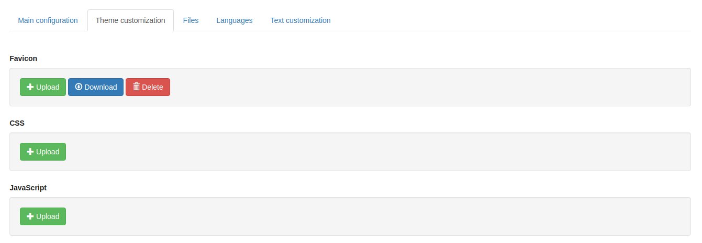
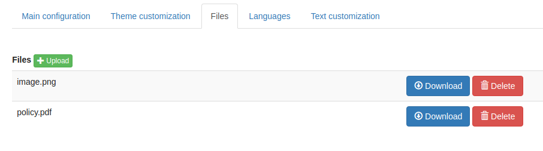
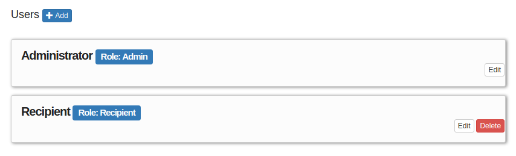
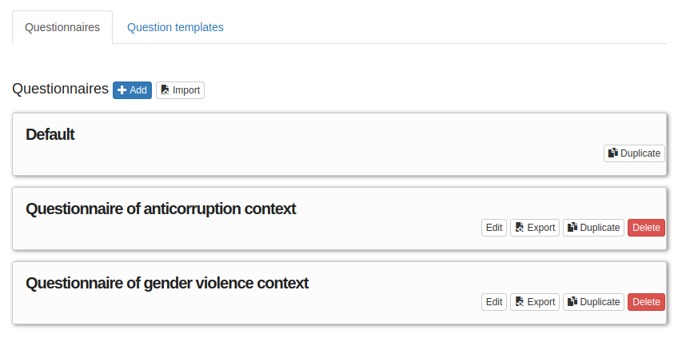

===============================
Overview of the user interfaces
===============================
This overview offers you a summary of the user interfaces offered to Admin users.

Anytime you log in as administrator via the Login page the application takes you to your personal administrative Homepage; This page includes some documentation about GlobaLeaks that is intended to clarify you all the up-to-date documentation in matter of software security, best practices and community support.

From this Home page you may access all the common user facilities already described in the general User Documentation.

.. image:: imgs/home.png

A menu on the right offers you links to the different administative sections:
   1. Site settings

   2. Users

   3. Questionnaires

   4. Contexts

   5. Case management

   6. Notification settings

   7. Network settings

   8. Advanced settings

   9. System overview

Site settings
-------------
This is the section that offers you all the main customization possibilities necessary for implementing a basic and functional whistleblowing site.

This section is furtherly divided in:
   1. Main configuration

   2. Theme customization

   3. Files

   4. Languages

   5. Text customization

Main configuration
..................
In this section is configurable the logo and all the texts of the main user interfaces.

.. image:: imgs/site_settings.png

Theme customization
...................
In this section could be loaded CSS and Javascript files necessary to customize the interface.

Files
.....
In this section could be loaded any file that need to be served via the platform to whistleblowers (e.g. a policy in PDF) or that are required by your CSS and Javascript customization.

Languages
.........
In this section you could enable all the languages required by your project and configure the default language.

.. note::
   Thanks to the `Localization Lab <https://www.localizationlab.org/>`_ and our great voluneer comminity, the software is already available and continously made available in a lot of languages. This aspect of internationalization is crucial in many projects. In case you are starting a project and the required languages are not available we strongly invite you to register on our `web translation platform <https://www.transifex.com/otf/globaleaks/>`_ offered by `Transifex <https://www.transifex.com/otf/globaleaks/>`_ and support yourself the translation. Internationalization and Localization is in fact are crucial for the success of a whistleblowing project. Thank you!

.. image:: imgs/languages.png

Text customization
..................
Here could be confiured overrides for any of the texts of the platform and of their translation.

.. image:: imgs/text_customization.png

Users
-----
This sections is where users could be created and managed.
The system with the basic configuration completed with the initial Platform wizard is configured with an Administrator and a Recipient.

Depending on your project needs here you could create users with different roles and manage their respective privileges:
   1. Administrators

   2. Recipients

   3. Custodians

Questionnaires
--------------
This section is where whistleblowing questionnaires could be created and managed.
The system with the basic configuration completed with the initial Platform wizard is configured with a single Default questionnaire not editable and pre-associated to the Default Context.

Depending on your project needs here you could create additional Questionnaire for each of your different contexts.

This section is furtherly divided in:
   1. Questionnaires

   2. Question templates

Depending on your project needs you may evaluate defining some questions once as Question Templates and reuse the same question in multiple questionnaires.

.. image:: imgs/question_templates.png

Contexts
--------
This section is where whistleblowing contexts (channels) could be created and managed.
The system with the basic configuration completed with the initial Platform wizard is configured with a single Context (whistleblowing channel) called Default.

Depending on your project needs here you could create additional Contexts and configure their respective properties.

.. image:: imgs/contexts.png

Case management
---------------
This section is intended to host all the main case management feature that will be offered by the software.
Currently it hosts the possibility to define submissions statuses and substatuses intended to be used by Recipients while working on the submissions.

By default the system includes the following submission statuses:
   1. New

   2. Open

   3. Closed

Within this section you may add additional Statuses between the State Open and Closed and you can furtherly define Substatuses for the Closed status (e.g. Archived / Spam)

.. image:: imgs/submission_statuses.png

Notification settings
---------------------
This is the section where are configured all the aspects related to the mail notifications sent by the software.

The section is furtherly divided in:
   1. Main configuration

   2. Notification templates

Main configuration
..................
Here are configured the techinical details about SMTP.

.. note::
   By default Globaleaks comes with a working configuration that is based on systems offered by the GlobaLeaks developers to the community of users and testers; even though this configuration is designed by their owners with special care in relation to security and privacy you are invited to consider using alternative systems for your production enviroment.

.. image:: imgs/notification_settings.png

Notification templates
......................
In this section are configured the notification templates.

By default globaleaks includes text and translations for each of the templates that are provided to be fully functional and studied with particular care in relation to security and privacy.
Depending on your project needs you may override the default text with your customized texts.

.. image:: imgs/notification_templates.png

Network settings
----------------
In this section are configured the newtork settings.

The section is furtherly divided in:
   1. HTTPS

   2. Tor

   3. IP Access control

HTTPS
.....
Here you can configure all the aspects related to the access of the platform via the HTTPS Protocol.

.. image:: imgs/https.png

In particular here are configured:
   1. The domain name used by your project

   2. The HTTPS key and certificates

To ease the deployment and the maintainance and reduce the costs of your project, consider using the software includes support for the Let'sEncrypt HTTPS certificates.

Tor
.....
Here you can configure all the aspects related to the access of the platform via the Tor Protocol.

.. image:: imgs/tor.png

IP Access Control
.................
Here you can configure IP based Access Control.

.. image:: imgs/ip_access_control.png

Suggested configurations are:
   1. Prevent Whistleblowers to report from whithin their respective work space.

   2. Restrict Recipients access to their intranet.

Advanced settings
-----------------
TODO

.. image:: imgs/advanced_settings.png

.. image:: imgs/url_shortener.png

.. image:: imgs/anomaly_thresholds.png

System overview
---------------
TODO

.. image:: imgs/system_overview.png
