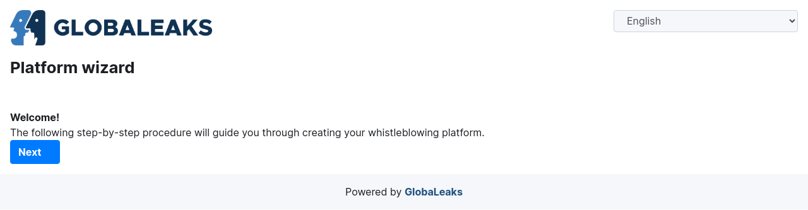
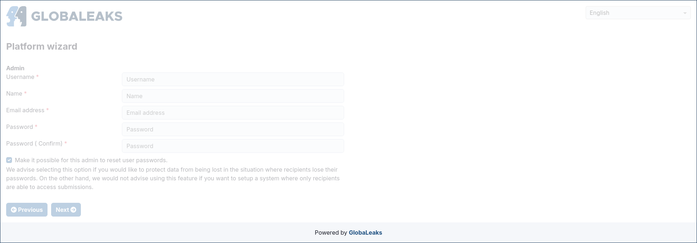
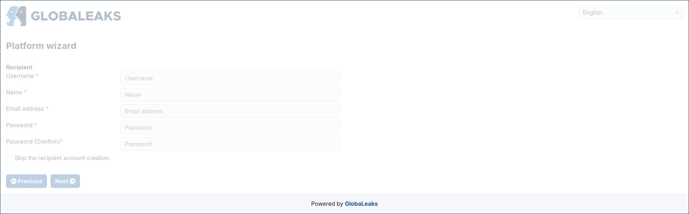
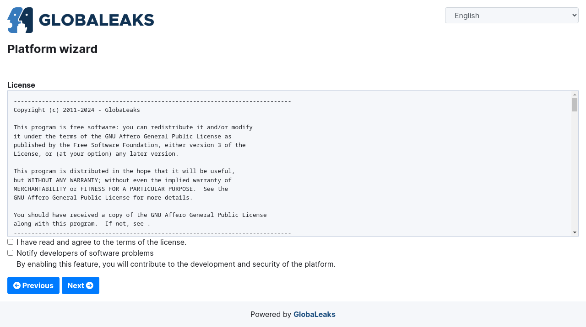
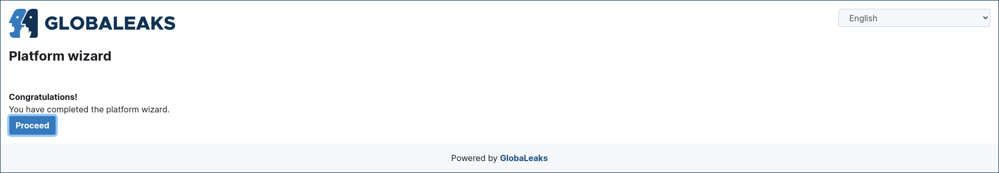

Platform Wizard
===============
After installing GlobaLeaks, you can proceed with the platform wizard.

Open a browser at port 443 or port 8443 on your remote or local IP, respectively.

We recommend performing the wizard either using the Tor address provided at the end of the setup or on localhost via a VPN.

Choose the Primary Language for Your Site
-----------------------------------------
On the first page of the wizard, you will be prompted to select the language for your site. The default choice is English, but many other languages are available, with more expected in the future.

Choose a Name for Your Project
------------------------------
In the second section of the wizard, configure the name of your project.

.. image:: ../images/wizard/2.png

Configure the Account for the Administrator of Your Whistleblowing Site
-----------------------------------------------------------------------
In the third section of the wizard, configure the account details for the administrator of your project.

Be sure to choose a strong password to protect this sensitive account; an indication of the strength of the chosen password is provided to guide you.

Configure the Account for the First Recipient of Reports
--------------------------------------------------------
In the fourth section of the wizard, configure the account details for the first recipient of reports sent to your project.

Read and Accept the License
---------------------------
In the fifth section of the wizard, you will be prompted to read and accept the GlobaLeaks License.

Complete the Wizard
-------------------
The sixth section of the wizard confirms the completion of the setup.

