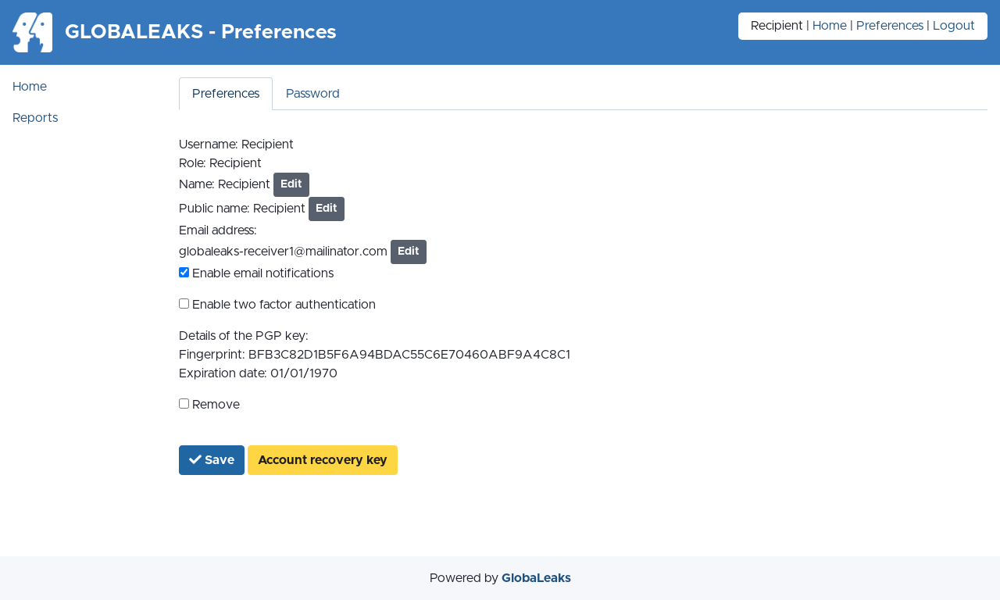

Common to All Users
===================
Login
-----
Users could login by accessing the ``/#/login`` page.

.. image:: ../images/user/login.png

Access the User Preferences
---------------------------
After login Users could access their preferneces by clicking the ``Preferences`` link present in the login status bar.

.. image:: ../images/user/preferences.png

Change Your Password
--------------------
Users could change their own password by accessing the ``Password`` tab present in the ``Preferences`` page.

.. image:: ../images/user/password.png

Reset Your Password
-------------------
Users could requests a password reset via the ``/#/login`` page by clicking the ``Forgot password?`` button.

After clicking the button users are requested to type their own username or email address.

.. image:: ../images/user/login.png

.. image:: ../images/user/password_reset_1.png

.. image:: ../images/user/password_reset_2.png

Enable Two-Factor-Authentication (2FA)
--------------------------------------
Users could enable Two-Factor-Authentication by clicking the ``Enable two factor authentication`` option inside the ``Preferences`` page.

To enable the feature the user requires to have a phone with installed a common ``Authenticator APP`` implementing the TOTP standard as by `RFC 6238 <https://tools.ietf.org/html/rfc6238>`_

.. image:: ../images/user/2fa.png

Access and Save Your Account Recovery Key
-----------------------------------------
Users could access their own Account Recovery key by clicking the ``Account Recovery Key`` button present in the ``Preferences`` page.

This is a fundamental step that any user should do at their first login after activating their own account in order to backup their own account recovery key and get sure to not incurr in data loss due to password loss.

.. image:: ../images/user/recoverykey.png

Load a Public PGP Key
---------------------
GlobaLeaks implements by default an advanced and automatic :doc:`Encryption Protocol <../security/EncryptionProtocol>` that uses online keys.

Users have the optional possibility to load a personal ``Public PGP Key`` by uploading or pasting the key on their ``Preferences`` page.

When a PGP key is loaded onto the platform any file uploaded on the platform and email notification sent by the platform is encrypted with it. This is an optional additional measure of security that should be evaluated and adopted in relation the threat model of the project.

.. image:: ../images/user/preferences.png

