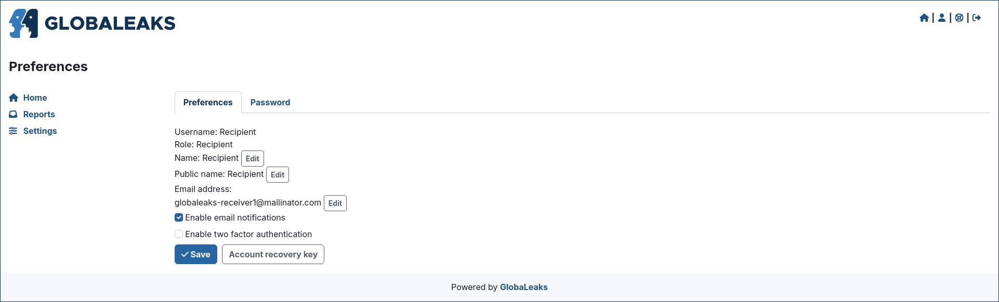
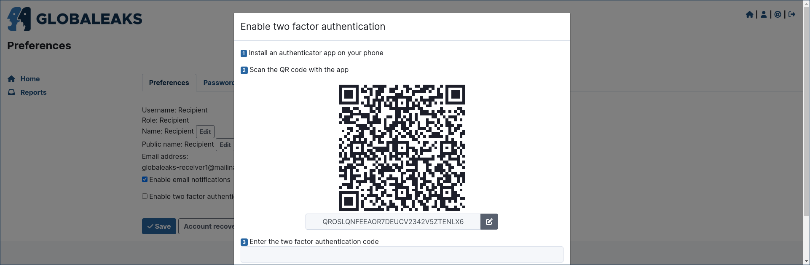
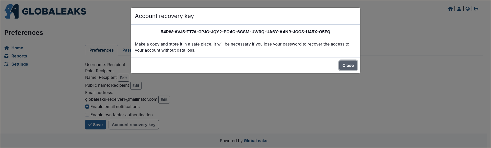

Common to all users
===================
Login
-----
Users could login by accessing the ``/#/login`` page.

Access the user preferences
---------------------------
After login Users could access their preferences by clicking the ``Preferences`` link present in the login status bar.

Change your password
--------------------
Users could change their own password by accessing the ``Password`` tab present in the ``Preferences`` page.

Reset your password
-------------------
Users could requests a password reset via the ``/#/login`` page by clicking the ``Forgot password?`` button.

After clicking the button users are requested to type their own username or email address.

Enable two-factor-authentication (2fa)
--------------------------------------
Users could enable Two-Factor-Authentication by clicking the ``Enable two factor authentication`` option inside the ``Preferences`` page.

To enable the feature the user requires to have a phone with installed a common ``Authenticator APP`` implementing the TOTP standard as by `RFC 6238 <https://tools.ietf.org/html/rfc6238>`_

Access and save your account recovery key
-----------------------------------------
Users could access their own Account Recovery key by clicking the ``Account Recovery Key`` button present in the ``Preferences`` page.

This is a fundamental step that any user should do at their first login after activating their own account in order to backup their own account recovery key and get sure to not incur in data loss due to password loss.

