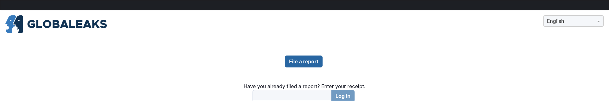
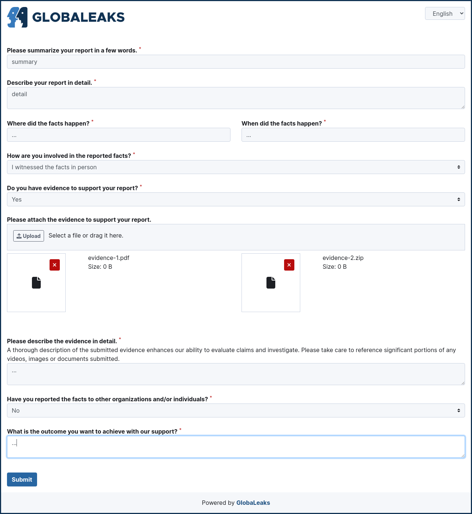
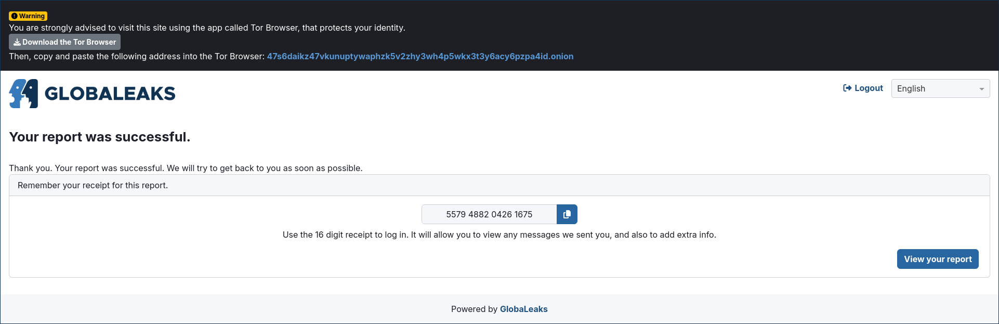
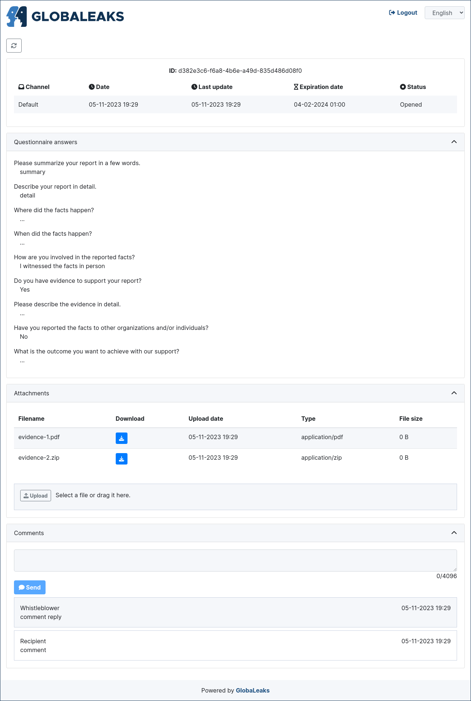

For Whistleblowers
==================

File a New Report
-----------------
A new report can be filed by accessing the homepage of the platform and clicking the ``Blow the Whistle`` button.

After filing a new report the systems provides to the user a 16-digit receipt.

Access an Existing Report
-------------------------
An existing report can be accessed by entering the 16-digit receipt obtained at the end of the submission on the login interface present on the home page of the platform.

