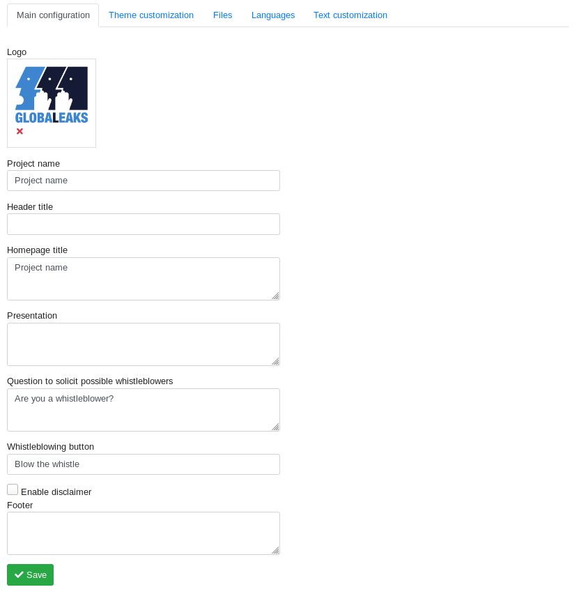
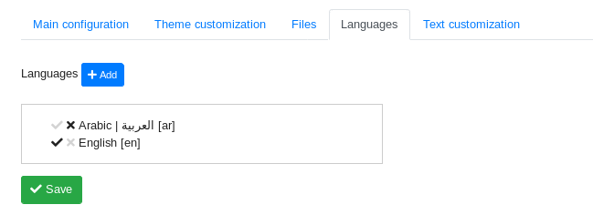

=====================
Common configurations
=====================
Configure the logo
-------------------------

The first thing you want to give to your whistleblowing site is a branding identity; this could be done by loading a logo in section Site settings / Main configuration.

Scroll down along the page to reach the "Save" button, click on it and have your logo and favicon applied.

Enable languages
---------------------------

You may want your GlobaLeaks installation served on more than one language

To do so, in the section "Site settings / Languages" select the languages you would like and add them.

Note that in the same interface you can mark the default application language.

Configure notification settings
-------------------------------
GlobaLeaks sends out notifications of different events to different receivers and to admins. In order to have this working, you have to select  "Notification Settings" in the "Administration Interface - General Settings" page and set up email account and related server parameters.

We suggest you to setup an email account dedicated to sending out notifications from your initiative.

.. image:: imgs/notification_settings.png

Enter the followings:

- SMTP name: the name of your GlobaLeaks project or something that equally descriptive
- SMTP email address: the email address used to send notifications
- Username: the username corresponding to the just inserted "SMTP email address"; this is needed to authenticate to the SMTP server and send emails
- Password: Password of the above corresponding "SMTP email address"
- SMTP Server Address: it is the hostname of the SMTP server you are using to send notification emails
- SMTP Server Port: Port used to send outgoing emails. It is usually 465 or 587 (SMTP with TLS is at TCP port 587; SMTP with SSL is at 465)
- Transport Security: from the drop down menu select the opportune security level

It is better to leave untouched the pre-defined settings pertaining the notification to admins and to recipients, but in the case you want to disable them, it is possibile to check the corresponding checkboxes.

You can then set the value for the time at which the notification alert of expiring submission; this value is set at 72hours to give time to the recipient(s) to check and manage the pending submissions.

It is possible to tweak the maximum number of emails allowed in an hour, before email wil be suspended in order to avoid flooding the system. It is advised to keep the pre-defined value, and eventually change it accordingly with mail server capabilities.

Once configured all the parameters for notifications, it is possible to test them by just clicking on the "Test the configuration" button.

If all is working as expected, click on the "Save" button to keep the configured parameters.

Configure recipients
--------------------
The Recipient is the person that will receive and process the data that whistleblowers input in the platform.
You can have one or multiple Recipients per Context, and also have one Recipient that can access to multiple Contexts. The platform is very flexible on this and allows you to define in very detail your whistleblowing system and procedure.

Configure questionnaires
------------------------
TODO

Configure contexts
------------------
TODO

Customize the graphic layout
--------------------------
Example 1: custom background
............................
This CSS example shows how to customize the Background Color of the application.

.. code-block:: css

   body
   {
      background-color: red;
   }

Example 2: custom font
......................

This CSS example shows how to customize the font of the application.

.. code-block:: css

   @font-face {
     font-family: 'Antani';
     src: url('static/antani.ttf') format('truetype');
     font-weight: normal;
     font-style: normal;
   }

   body {
     font-family: 'Antani', Helvetica, Arial, Sans;
     font-size: 16px;
   }
