User interface
==============
This section offers you a summary of the user interface offered to Admin users.

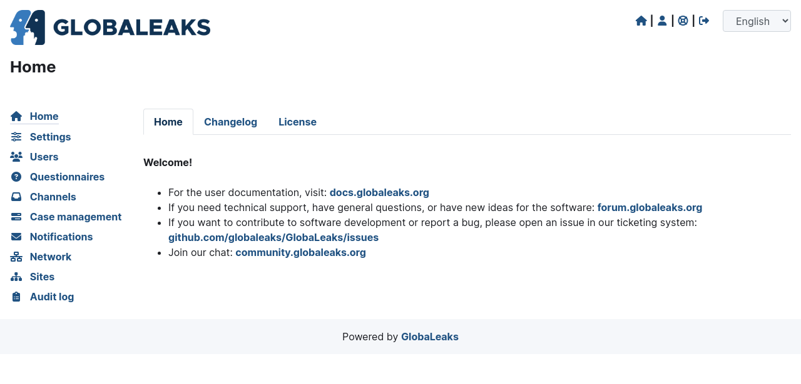

Through the menu you could access the following administrative sections:

   1. Settings

   2. Users

   3. Questionnaires

   4. Channels

   5. Case management

   6. Notification

   7. Network

   8. Sites

   9. Audit log

Settings
--------
This is the section that offers you all the main customization possibilities necessary for implementing a basic and functional whistleblowing site.

This section is furtherly divided in:

   1. Settings

   2. Files

   3. Languages

   4. Text customization

   5. Advanced settings

Settings
........
In this section is configurable the logo and all the texts of the main user interfaces.

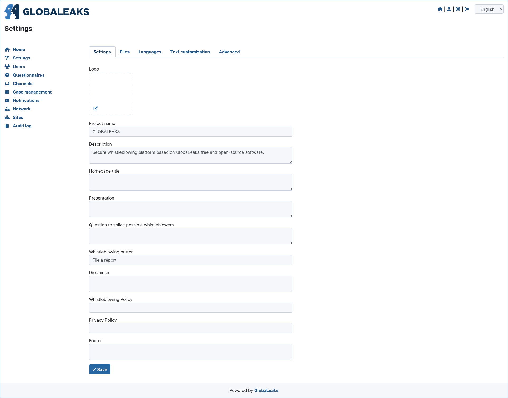

Files
.....
In this section could be loaded CSS and Javascript and other files necessary to customize the interface.

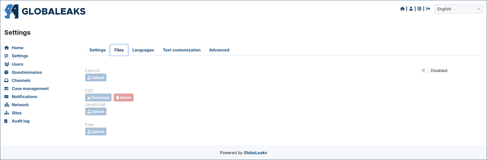

Languages
.........
In this section you could enable all the languages required by your project and configure the default language.

.. note::
   Thanks to the `Localization Lab <https://www.localizationlab.org/>`_ and our great volunteer community, the software is already available and continuously made available in a lot of languages. This aspect of internationalization is crucial in many projects. In case you are starting a project and the required languages are not available we strongly invite you to register on our `web translation platform <https://www.transifex.com/otf/globaleaks/>`_ offered by `Transifex <https://www.transifex.com/otf/globaleaks/>`_ and support yourself the translation. Internationalization and Localization is in fact are crucial for the success of a whistleblowing project. Thank you!

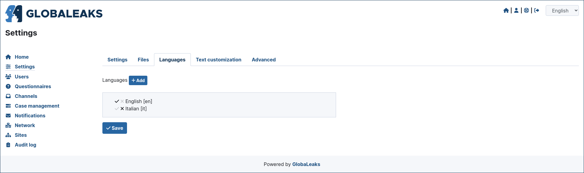

Text customization
..................
Here could be configured overrides for any of the texts of the platform and of their translation.

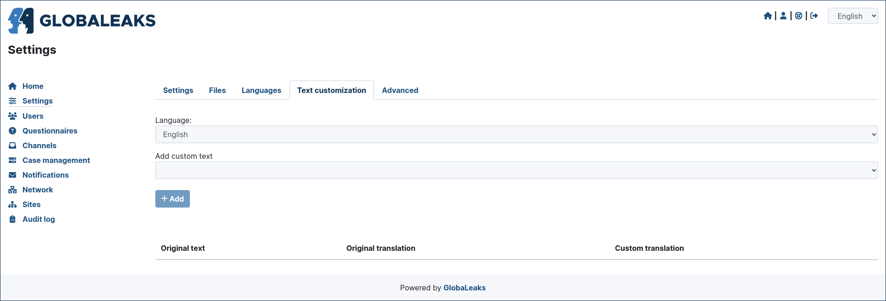

Advanced settings
.................
In this section could be configured a set of advanced settings.

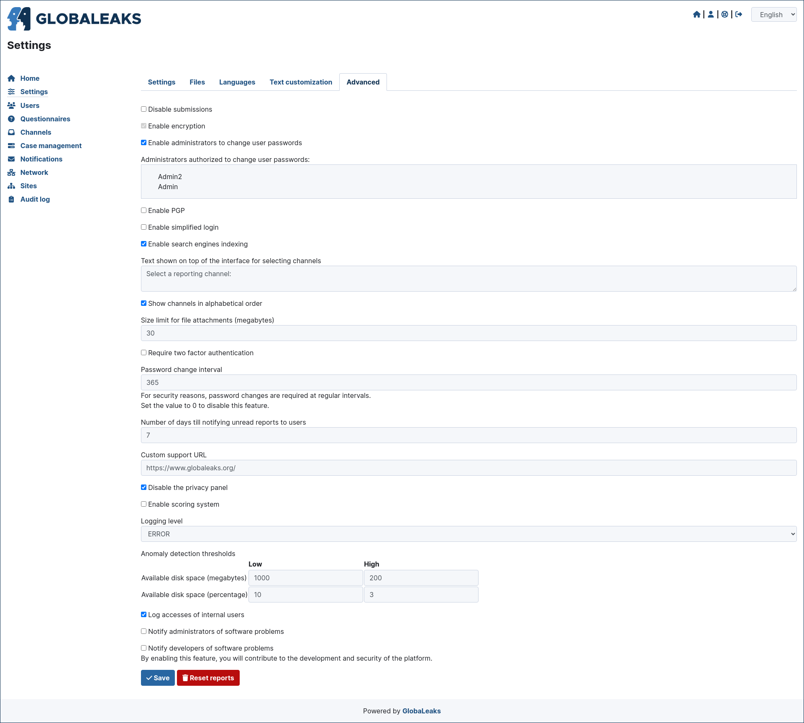

Users
-----
This sections is where users could be created and managed.
The system with the basic configuration completed with the initial Platform wizard is configured with an Administrator and a Recipient.

Depending on your project needs here you could create users with different roles and manage their respective privileges.

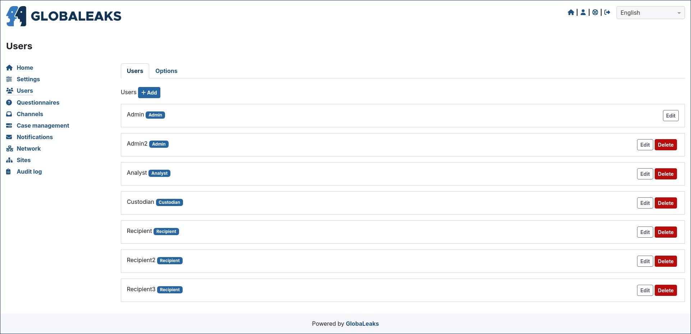

User roles
..........
The software offers the possibility to create users with the following roles:

   1. Administrators

   2. Recipients

User options
............

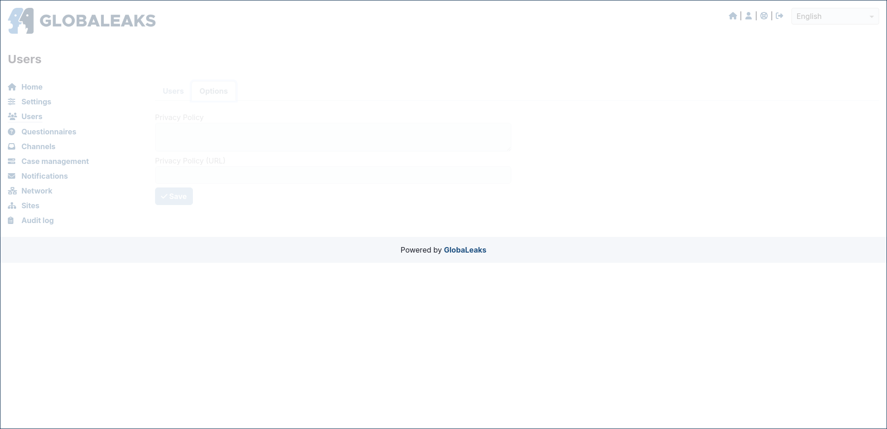

Questionnaires
--------------
The softare implements a standard default questionnaire that is proposed as a good base for a generic whistleblowing procedure. This questinnaire is the current result of the research performed by the project team with the organizations that have adopted the solution and expecially with anticorruption and investigative journalism NGOs.

As every organization has different needs, risks and goals globaleaks has been designed considering to implement an advanced questionnaire builder offering the possibility to design custom questionnaires.

The following sections present the questionnaire builder and its capabilities.

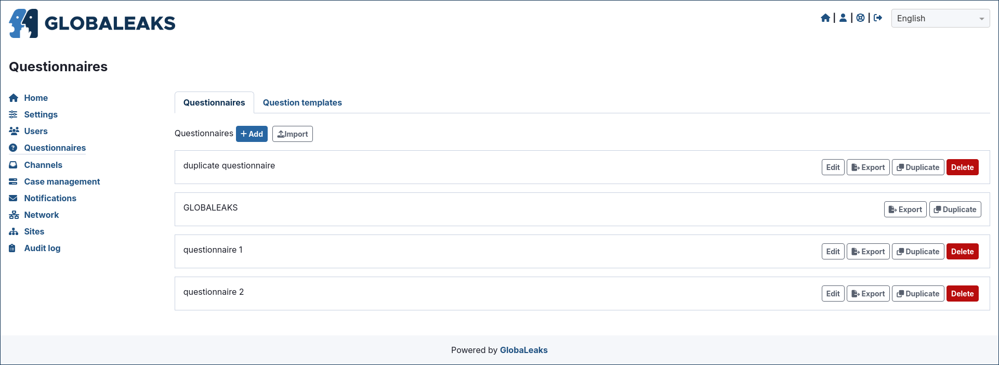

Depending on your project needs you may evaluate defining some questions once as Question Templates and reuse the same question in multiple questionnaires.

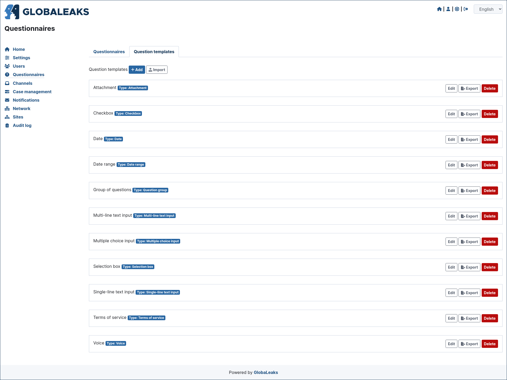

Steps
.....
The software enables to organize questionnaire in one or multiple steps.
For example the default questionnaire is organized with a single step including all the questions.

Questions types
...............
The software enables you to create questions of the following types:

   1. Single-line text input

   2. Multi-line text input

   3. Selection box

   4. Multiple choice input

   5. Checkbox

   6. Attachment

   7. Terms of service

   8. Date

   9. Date range

   10. Voice

   11. Question group

Common question properties
...........................
Each of the software question types make it possible to configure the following properties:

  Question: The text of the question

  Hint: A hint that will be shown via an popover an a question mark near the question.

  Description: A description text that will be shown below the question

  Required: Set this field if you want this question to be mandatory

  Preview: Set this field if you want the answers to this question to appear in the preview section of the list

Channels
--------
This section is where whistleblowing channels could be created and managed.

A whistleblowing channel is typically defined by the following main characteristics

    Name: the name of the channel
    Image: an image to identify the channel
    Description: a description of the channel
    Recipients: the set of recipients that will receive reports sent to this channel
    Questionnaire: the questionnaire that will be proposed to whistleblowers selecting this channel
    Submission expiration: the data retention policy for the channel

The system with the basic configuration completed with the initial platform wizard is configured with a single Channel called Default, on which is associated a recipient and the default questionnaire.

Depending on your project needs here you could create additional Channels and configure their respective properties.

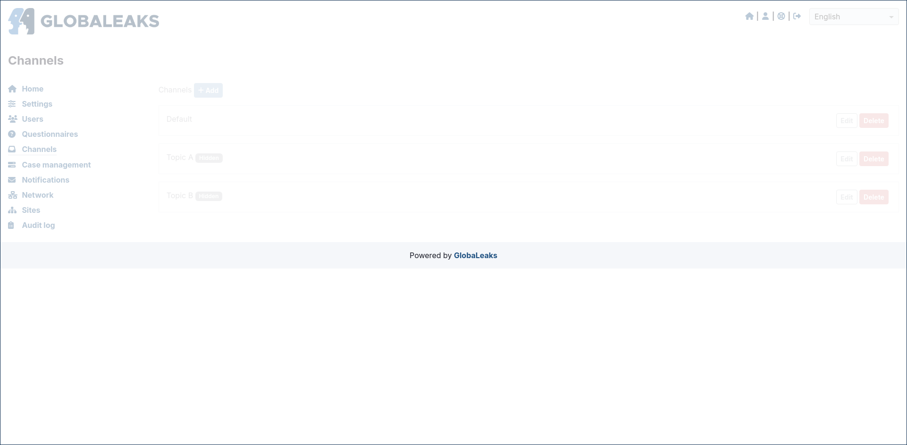

Data retention policy
.....................
The software enables to configure a data retention policy for each channel.
This is a fundamental property of the whistleblowing channel that makes it possible to configure automatic secure deletion of reports after a certain period of time.
This setting should be configured in relation to the risk of the channel in order to limit unneeded exposure of the reports received therein.

By default a channel is configured with a report expiration of 90 days.

Case management
---------------
This section is intended to host all the main case management feature that will be offered by the software.
Currently it hosts the possibility to define reports statuses and sub-statuses intended to be used by Recipients while working on the reports.

By default the system includes the following report statuses:
   1. New

   2. Open

   3. Closed

Within this section you may add additional Statuses between the State Open and Closed and you can furtherly define Sub-statuses for the Closed status (e.g. Archived / Spam)

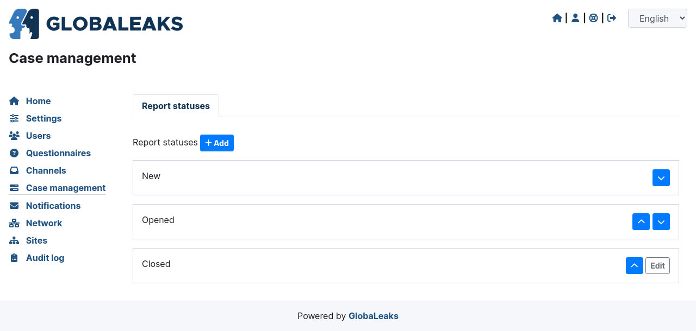

Notification
------------
This is the section where are configured all the aspects related to the mail notifications sent by the software.

The section is furtherly divided in:
   1. Notification Settings

   2. Notification Templates

Notification settings
.....................
Here are configured the technical details about SMTP.

.. note::
   By default GlobaLeaks comes with a working configuration that is based on systems offered by the GlobaLeaks developers to the community of users and testers; even though this configuration is designed by their owners with special care in relation to security and privacy you are invited to consider using alternative systems for your production environment.

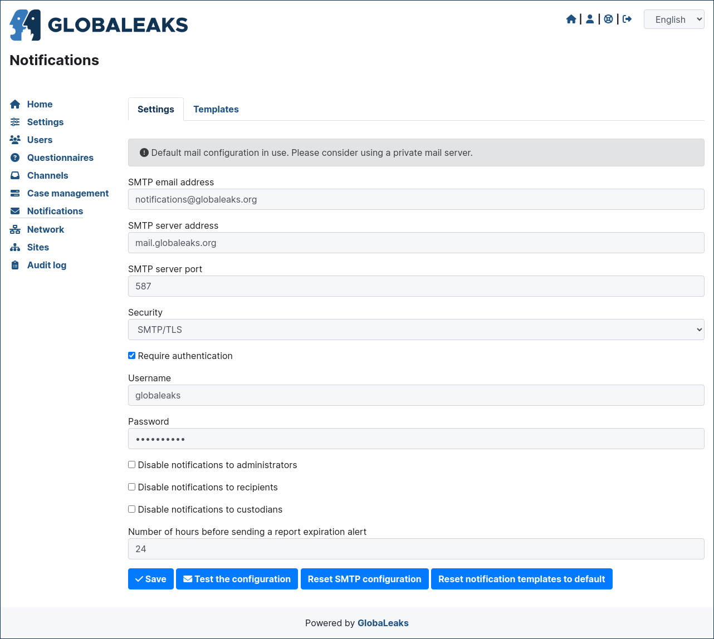

Notification templates
......................
In this section are configured the notification templates.

By default globaleaks includes text and translations for each of the templates that are provided to be fully functional and studied with particular care in relation to security and privacy.
Depending on your project needs you may override the default text with your customized texts.

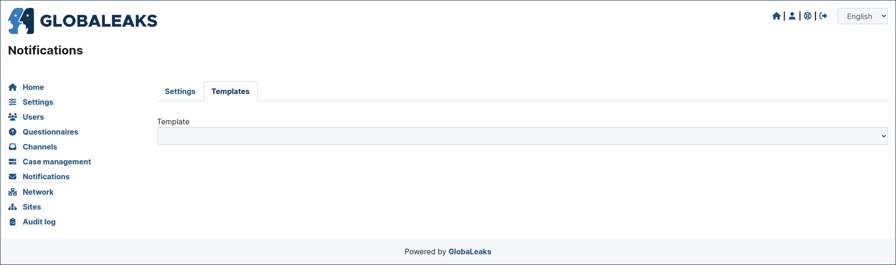

Network
-------
In this section are configured the network settings.

The section is furtherly divided in:
   1. HTTPS

   2. Tor

   3. IP Access control

   4. URL Redirects

HTTPS
.....
Here you can configure all the aspects related to the access of the platform via the HTTPS Protocol.

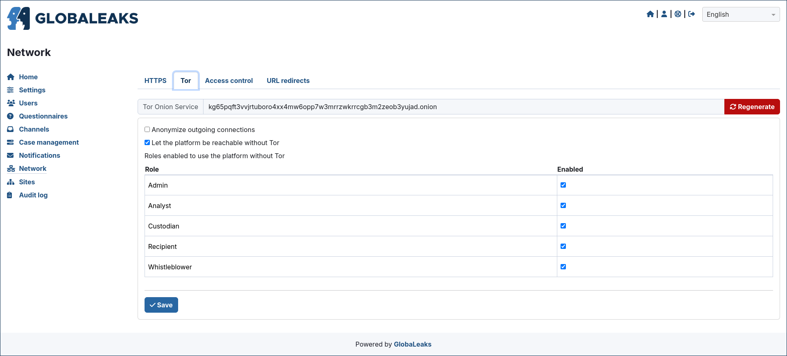

In particular here are configured:

   1. The domain name used by your project

   2. The HTTPS key and certificates

To ease the deployment and the maintenance and reduce the costs of your project, consider using the software includes support for the Let’s Encrypt HTTPS certificates.

Tor
...
Here you can configure all the aspects related to the access of the platform via the Tor Protocol.

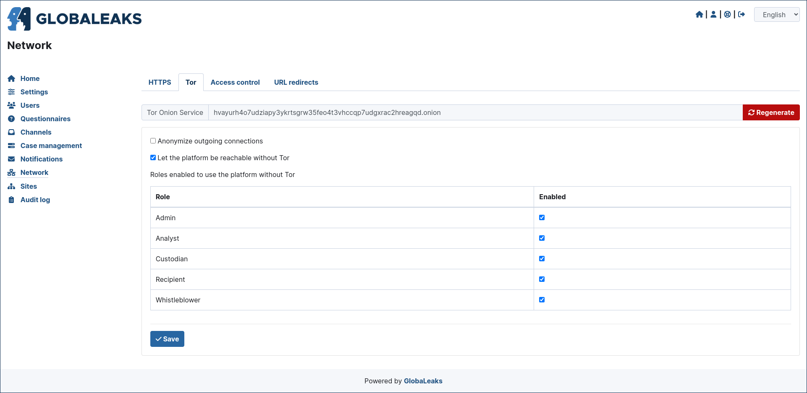

IP access control
.................
Here you can configure IP based Access Control.

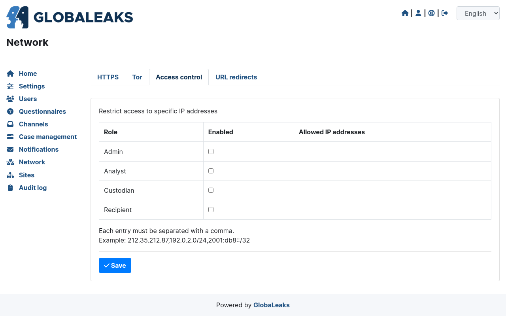

Suggested configurations are:

   1. Prevent Whistleblowers to report from within their respective work space.

   2. Restrict Recipients access to their intranet.

URL redirects
.............
Here you can configure URL Redirects.

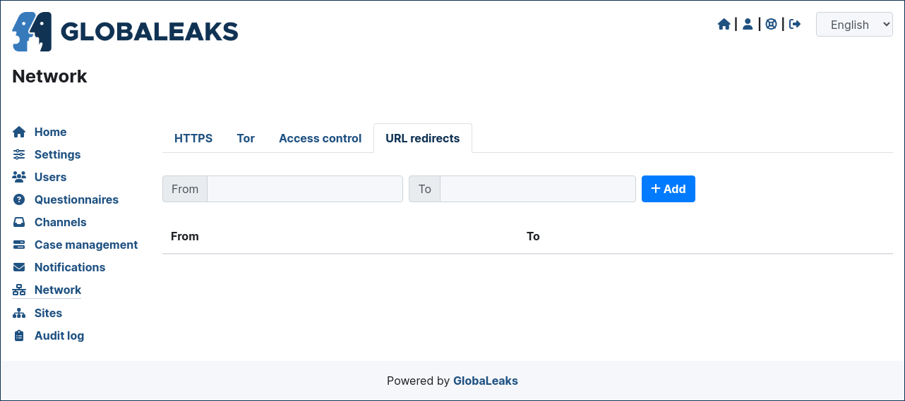

Sites
-----
The site section enables organization to create and manage multiple secondary whistleblowing sites.

Sites management
................
Secondary whistleblowing platforms with independent configurations can be manually created and managed through the Sites interface.

Organizations have typically need for creating a secondary site when dealing with subsidiaries or third party clients.

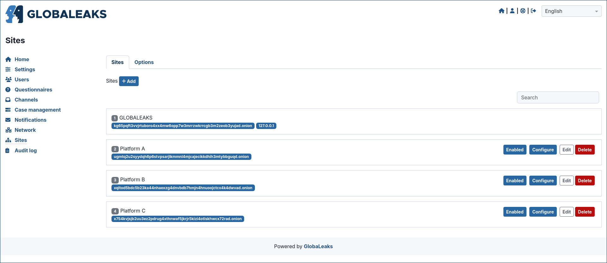

After creating a secondary site an administrators of the main site could simply enter on that system by clicking a "Configure" button.

After clicking on the button the administrator will be logged in on the the administrative panel of the site.

Signup module
.............
The software features a signup module that can be enabled and used to offers others users the possibility to register their secondary site.

Organizations have typically need for a signup module when offering the platform to other subsidiaries or third party clients where they want users to have the possibility to self subscribe.

The signup feature can be anabled in the Options tab of the Sites section.

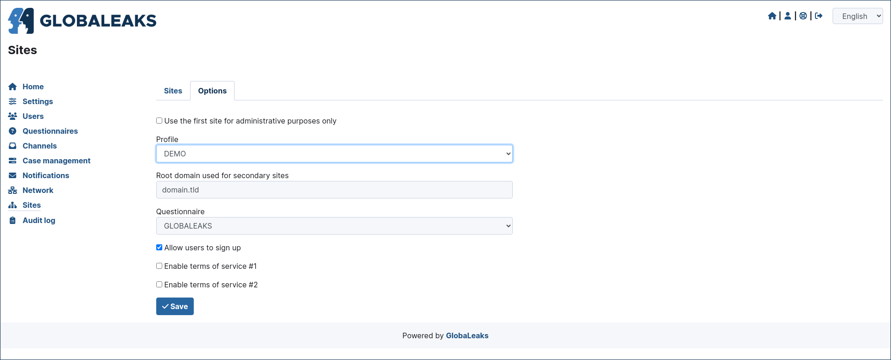

When the signup module is enabled the submission module of the main site is automatically disabled and the home page will be featuring the following signup form:

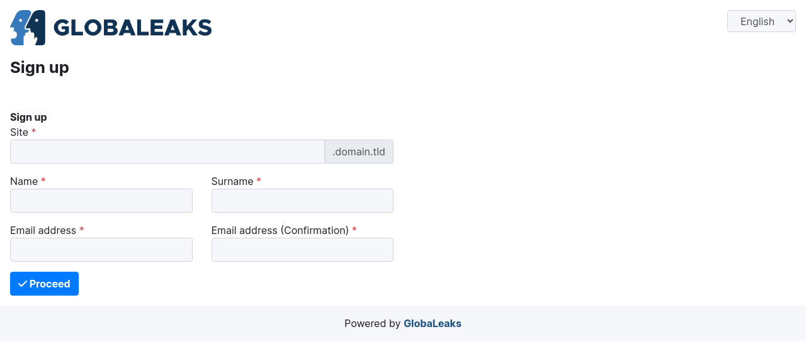

Audit log
---------
The software features a privacy precerving audit log enabling administrators of the system to supervise on projects operations.

.. image:: ../../images/admin/audit_log.png

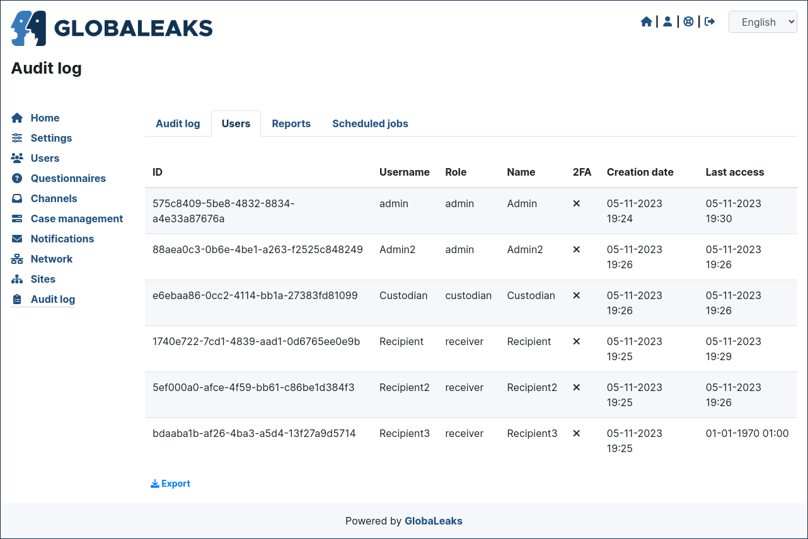

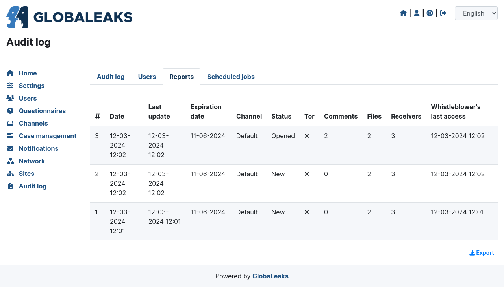

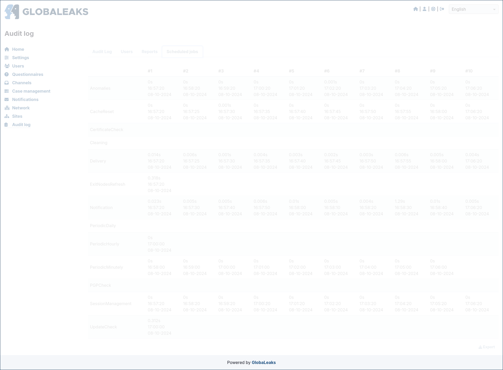
